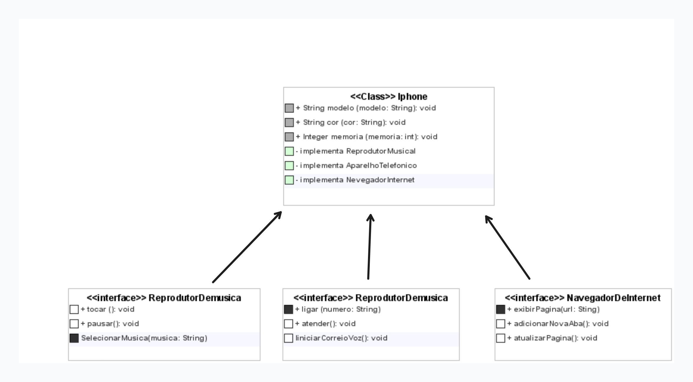

# Trilha Java
## _Modelando um Iphone_

Modelando um modelo UML ceitual do Iphone e o implementando, ultilizando os conceitos de programação orientada a objetos.

## Diagrama UML:

## Interfaces
- AparelhoTelefonico 📞
  + ligar 
  + atender
  + iniciarCorreioVoz
- NavegadorInternet 🌐
  + exibirPagina 
  + adicionarNovaAba
  + atualizarPagina
- ReprodutorMusical 🔊
  + tocar 
  + pausar
  + selecionarMusica
  
## Iphone

- modelo
- cor
- memoria

